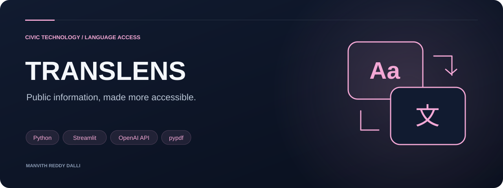
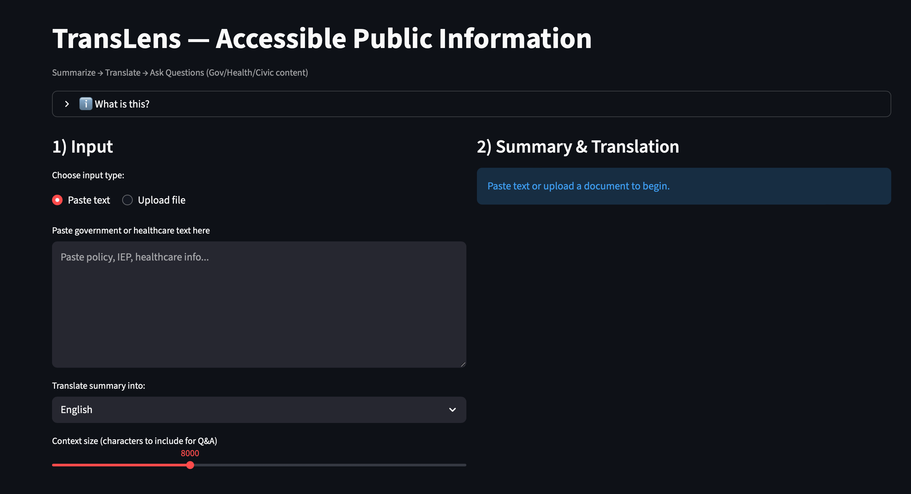
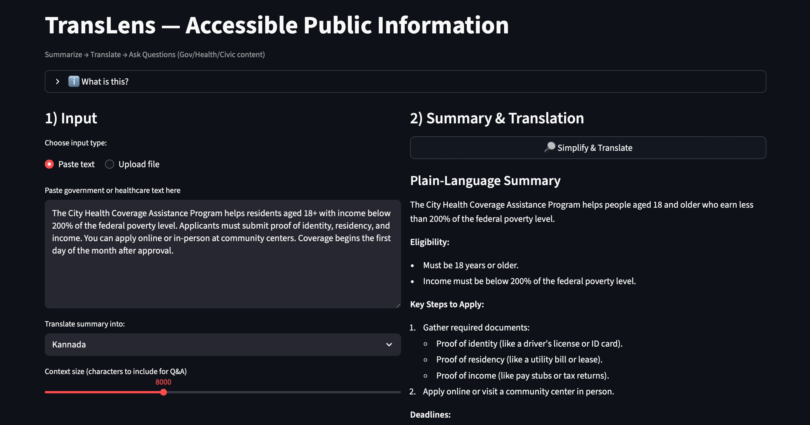
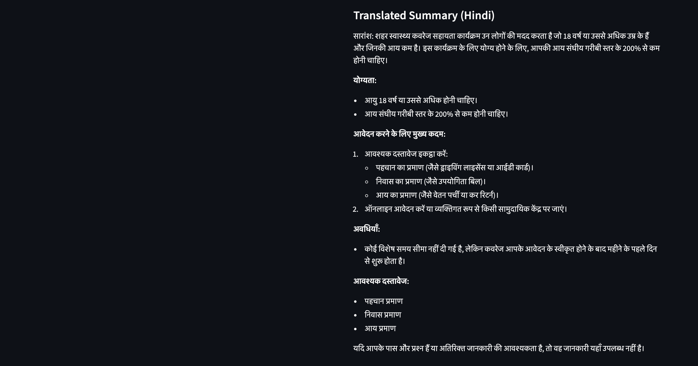
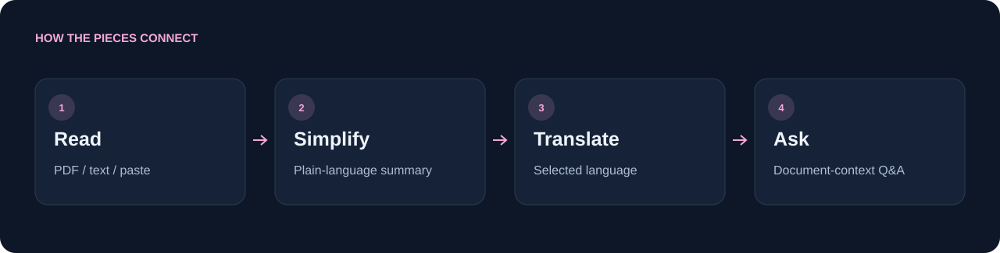
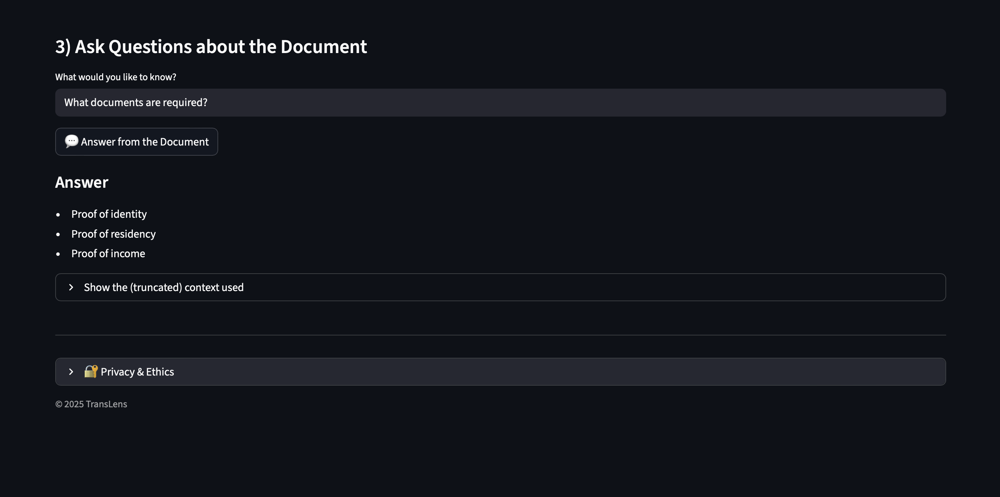
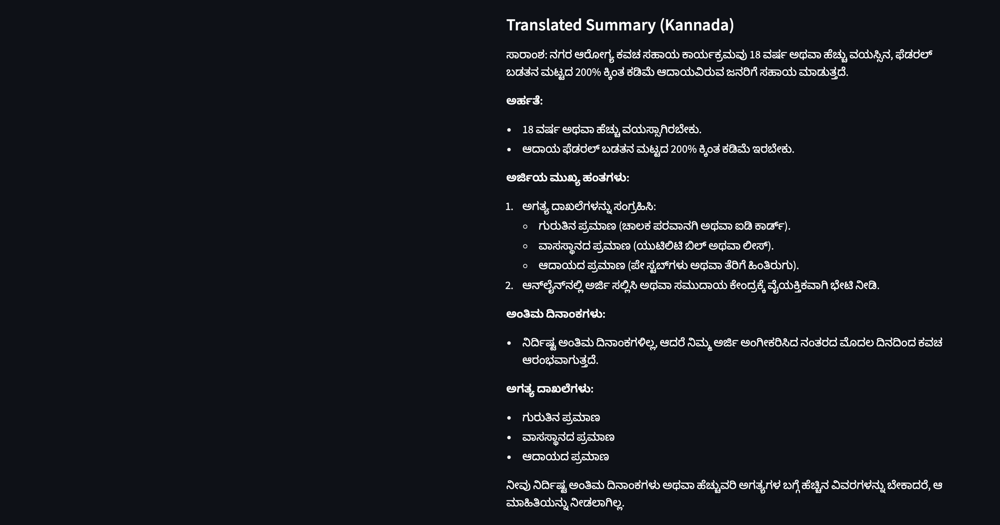

<p align="center"></p>

<h1 align="center">Translens</h1>

<p align="center">Public information, made more accessible.</p>

<p align="center"><code>Python</code> &nbsp; <code>Streamlit</code> &nbsp; <code>OpenAI API</code> &nbsp; <code>pypdf</code></p>

<p align="center"><a href="#see-it-in-action">See it in action</a> · <a href="#how-it-works">How it works</a> · <a href="#quick-start">Quick start</a> · <a href="#technology-and-code-map">Technology and code map</a> · <a href="#scope-and-data-handling">Scope and data handling</a></p>

<table><tr><td width="33%" valign="top"><h3>Understand the document</h3><p>Turn dense public information into a plain-language summary.</p></td><td width="33%" valign="top"><h3>Cross language barriers</h3><p>Generate translations in the selected interface language.</p></td><td width="33%" valign="top"><h3>Ask focused questions</h3><p>Use the document context to guide follow-up answers.</p></td></tr></table>

---

## See it in action



<table><tr><td width="50%"><br/><b>Understand the document</b></td><td width="50%"><br/><b>Read in another language</b></td></tr></table>

## How it works



PDF extraction and text cleanup feed the summarization prompt. The summary is translated into the selected language, while questions use a limited portion of the original document as context. The current approach uses context stuffing rather than a vector database.

## Quick start

```sh
git clone https://github.com/Manvith-d/translens.git
cd translens
python -m venv .venv
source .venv/bin/activate
pip install -r requirements.txt
```

Create `.streamlit/secrets.toml` and set `OPENAI_API_KEY` locally, then start the app:

```sh
streamlit run app.py
```

Keep the secrets file out of Git. On Windows, activate with `.venv\Scripts\activate`. Model access depends on the configured OpenAI account; the source preserves the original model and fallback choices.

**Try the included example:** open `assets/sample_texts/sample_policy_en.txt`, choose a language, select **Simplify & Translate**, then ask “What documents are required?”

## Technology and code map

| Component | Technology / path |
| --- | --- |
| Web interface | Streamlit in `app.py` |
| Summarization and translation | OpenAI Chat Completions API |
| PDF extraction | pypdf |
| Text preparation | `utils/text_utils.py` |
| Prompt templates | `utils/prompts.py` |
| Demo input | `assets/sample_texts/` |

<details><summary><b>More interface views</b></summary>




</details>

## Scope and data handling

The application does not implement its own persistent document store, but document text is sent to the OpenAI API for processing. Use appropriate demonstration documents when trying it. Prompts ask for document-grounded answers; this is not a guarantee of correctness. Verify generated summaries and translations against the source, especially for healthcare or public-policy decisions.

## Future directions

Retrieval for longer documents, literacy-level controls, audio output, and multi-document comparison are possible extensions, not current functionality.

## Author and license

Manvith Reddy Dalli. MIT license; see [LICENSE](LICENSE).

